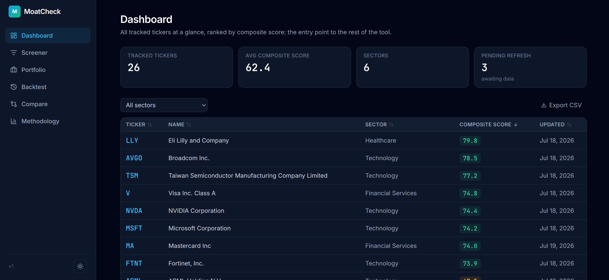

# MoatCheck

I'm a student, and this is a tool I built for myself to pick stocks for my own long-term portfolio (10-15 years, DCA). I mostly built it to actually learn quant finance by doing it, instead of just reading about ratios and backtests. It's also genuinely how I check my own portfolio now.

Live: https://moatcheck.onrender.com

It's not investment advice. It's a personal scoring system based on fundamentals and risk metrics, and I'm the only one adding tickers to it. If you use it, verify the numbers yourself.



## What it actually does

- Pulls fundamentals and price history from Alpha Vantage
- Scores each stock on two things: fundamentals (growth, margins, ROE, debt, FCF) and risk (volatility, Sharpe, drawdown)
- Combines both into one composite score (60% fundamentals / 40% risk, arbitrary weighting I chose, easy to change)
- Lets me backtest a "top N by score" strategy against SPY, without cheating by using data that wasn't available yet at that point in time
- Has a screener with filters, and a portfolio page to check correlation between what I hold

## Why it's built this way (some of it is annoying compromises)

**Weekly prices, not daily.** Alpha Vantage's free tier only gives full daily history behind a paywall. Weekly is enough for a long-term strategy, but it means max drawdown is probably underestimated a bit. I annualize volatility over 52 periods, not 252, which took me embarrassingly long to catch as a bug the first time.

**25 API calls a day, 5 per minute.** That's the free tier. Each ticker costs 7 calls to fully refresh, so realistically I load about 3 new tickers a day. Adding my whole universe of ~25-50 tickers takes over a week. There's a queue system and a progress tracker so it resumes cleanly instead of re-paying for calls I already made that day.

I spent way too long trying to fix this with Finnhub as a second data source. Long story short: it doesn't fix the quota, because the bottleneck isn't which API I call, it's that I re-fetch the entire quarterly history every time regardless of source. The actual fix was skipping the fetch entirely when no new quarterly report is expected yet. Details are in the code comments if you're curious, it was a whole detour.

**know_date.** This one matters. Fundamentals aren't available the moment a quarter ends, companies file weeks later. I approximate this with `report_date + 60 days` since Alpha Vantage doesn't give me the actual filing date. The backtest only uses a snapshot if its `know_date` has already passed at the simulated date. Without this the backtest would be cheating (using info from the future), which defeats the whole point. I only caught this after my first backtest gave suspiciously good results.

**No daily automation beyond a scheduled refresh.** A GitHub Action runs the refresh + score recompute once a day. Everything else (adding tickers, deeper reviews) I trigger by hand.

## Running it yourself

### 1. Supabase

Create a free project on supabase.com, run `backend/supabase_schema.sql` in the SQL editor, and grab your `Project URL` and `service_role` key.

The `service_role` key stays local only (in `backend/.env`, gitignored). Render only ever gets the `anon` key with read-only RLS policies. This matters because it's the only thing keeping the public site from being writable by anyone.

### 2. Backend

```bash
cd backend
python3 -m venv .venv
source .venv/bin/activate
pip install -r requirements.txt
cp .env.example .env   # fill in SUPABASE_URL, SUPABASE_KEY, ALPHA_VANTAGE_API_KEY, ADMIN_API_KEY
uvicorn app.main:app --reload --port 8000
```

Then seed a few tickers:

```bash
curl -X POST http://localhost:8000/api/refresh \
  -H 'Content-Type: application/json' \
  -d '{"tickers": ["NVDA","MSFT","TSM"]}'

curl -X POST http://localhost:8000/api/score/recompute
```

### 3. Frontend

```bash
cd frontend
npm install
cp .env.example .env.local   # NEXT_PUBLIC_API_URL=http://localhost:8000
npm run dev
```

http://localhost:3000

### 4. Deploying

It's all one Render service, because I didn't want to pay for or manage two. The frontend gets statically exported at build time and FastAPI just serves the static files directly, with the API living under `/api` so it doesn't collide with the frontend routes. `render.yaml` at the root has the full config, so Render's Blueprint option picks it up automatically, you just need to fill in the env vars.

## API

Everything's under `/api`. Full list and request/response shapes are on `/docs` once it's running (FastAPI gives you that for free). Rough overview:

| Route | What it does |
|---|---|
| `GET /api/stocks` | tracked tickers + latest score |
| `GET /api/stocks/{ticker}` | full detail: fundamentals, score breakdown, recent prices |
| `POST /api/stocks` | add a ticker (admin key required) |
| `POST /api/refresh` | run the data pipeline |
| `POST /api/score/recompute` | recompute scores |
| `GET /api/screener` | filterable/sortable list |
| `POST /api/backtest` | run a backtest |
| `GET /api/correlation` | correlation matrix for a list of tickers |

Adding tickers is gated by an `X-Admin-Key` header, checked against `ADMIN_API_KEY`. It's not real auth, it's just enough of a barrier for a personal, single-admin site. If that env var isn't set, the endpoint just fails closed, no accidental open write access.

## Things it doesn't do (on purpose, for now)

- No qualitative analysis. No "moat" judgment, no reading 10-Ks. There's an empty `qualitative_notes` table waiting for a v2 where I feed filings to an LLM, but that's not built yet.
- No daily prices, see above.
- Single curator. It's read-only for everyone except me.
- No real auth system, see admin key above.

## Why this exists

Honestly, mostly to learn. I wanted to actually understand what ROE, Sharpe ratio, and look-ahead bias mean by building something that has to get them right, not just by reading a textbook definition. I also use it for real, to sanity-check my own long-term portfolio before I add to it. It's rough in places and I'm still fixing bugs I find along the way (the ROE/FCF calculation was wrong for a while, calculated on a single quarter instead of trailing twelve months, that was a fun one to debug).

I used Claude Code for a good chunk of the implementation (FastAPI boilerplate, Next.js plumbing, deployment config). The part I actually wanted to learn was the quant finance side, not fighting with Supabase RLS policies or Next.js static export quirks, so I leaned on it for that and spent my time on the scoring logic, the backtest, and understanding why things like know_date or 52-vs-252 periods actually matter. I reviewed and fixed the logic myself along the way, but I won't pretend the boilerplate is all hand-typed.

If you find it useful or want to poke around the code, feel free. And if you want to support it, I take sponsors: https://github.com/sponsors/[your-username]